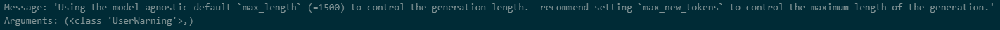
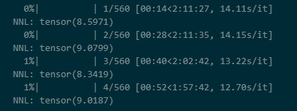

# MusicGen Perplexity

### Installation

~~~
pip install 'torch>=2.0'
pip install -U audiocraft
~~~

### Code Description

There are two importable python methods named "MusicGen_Perplexity()" and "generate()" in the file `my_modules.py`. 

- "MusicGen_Perplexity()": calculate the perplexity of a music audio by interfacing MusicGen. Specifically, it predicts an audio segment on condition that the left part of the audio exists, with the conditional input shifted right.
- "generate()": predict the next half of music audio according to the first half part. NOTICE: MusicGen only supports to generate audios shorter than 30 seconds, therefore the generated contents may be shorter than the first half part.

### How to Run the Code

First, make sure you have an audio example, which can be mp3/wav files.

~~~powershell
# Generate
python my_modules.py --method generate --text EDM --audio test.mp3
# Evaluate(PPL)
python my_modules.py --method evaluate --audio test.mp3
~~~

See more details using the command below:

 `python my_modules.py -h`

### Result

#### 1 my_modules.generate()

- out_1: 

	- parameter:
		- model = musicgen-small
		- text prompt="Energetic EDM"
		- Do not specify max_new_tokens, use the default max_length=1500

- out_2: 

	- parameter:
		- model = musicgen-small
		- text prompt="Energetic EDM with Clapping and Shouting"
		- Do not specify max_new_tokens, use the default max_length=1500

- out_3: 

	- parameter:
		- model = musicgen-small
		- text prompt="Energetic EDM with Clapping"
		- Do not specify max_new_tokens, use the default max_length=1500

	- result:

		- musicgen-small predicts about 12 seconds

			`  File "d:\anaconda\anaconda3\envs\tmp\lib\site-packages\transformers\models\musicgen\modeling_musicgen.py", line 2335, in generate
			    logger.warning(
			Message: 'Using the model-agnostic default `max_length` (=1500) to control the generation length.  recommend setting `max_new_tokens` to control the maximum length of the generation.'
			Arguments: (<class 'UserWarning'>,)`

			

- out_4:

	- parameter:
		- model = musicgen-small
		- text prompt="Energetic EDM with Clapping"
		- max_new_tokens=1024
	- result:
		- Generated 39-17=22 seconds of audio, with noticeable noise starting at 30 seconds

- out_5:

	- parameter:

		- model = musicgen-small

			text prompt="Energetic EDM with Clapping"

		- max_new_tokens=512

	- result:

		- Generated 28-17=11 seconds of audio, the connection is not very coherent

			It is estimated that at a sampling frequency of 32KHz, one second of audio is equivalent to 46.5 tokens

- out_6:

	- parameter:

		- model = musicgen-small

			text prompt="Energetic EDM with Clapping"

		- max_new_tokens=int(half of audio time * 46.5)

	- result:

		- Generated 34 seconds of audio to achieve "generate the second half of the audio based on the first half of the audio"
		- There is obvious noise starting from 30 seconds (see the follow-up text for the reason analysis)

- out_7:

	- parameter:
		- model = musicgen-medium
		- text prompt="Energetic EDM with Clapping"
		- max_new_tokens=int(half of audio time * 46.5)
	- result:
		- Generated 34 seconds of audio to achieve "generate the second half of the audio based on the first half of the audio"
		- There is obvious noise starting from 30 seconds

- out_8:

	- parameter:

		- **model = musicgen-medium**
		- text prompt="Energetic EDM"
		- max_new_tokens=int(half of audio time * 46.5)

	- result:

		- Generated 34 seconds of audio to achieve "generate the second half of the audio based on the first half of the audio"

		- There is obvious noise starting from 30 seconds

			**[Explains that the problem has nothing to do with the model size]**

- out_9:

	- parameter:

		- model = musicgen-medium
		- **text prompt="Energetic electric dance music"**
		- max_new_tokens=int(half of audio time * 46.5)

	- result:

		- Generated 34 seconds of audio to achieve "generate the second half of the audio based on the first half of the audio"

		- 30 seconds start to have obvious noise

			**【Explains that the problem has nothing to do with text prompt】**

- out_10:

	- parameter:
		- model = musicgen-small
		- **text prompt="Energetic electric dance music"**
		- max_new_tokens=int(half of audio time * 46.5)
	- result:
		- Generated 34 seconds of audio to achieve "generate the second half of the audio based on the first half of the audio"
		- 30 seconds start to have obvious noise
			- Cause of Noise：Generation is limited by the sinusoidal positional embeddings to 30 second inputs. Meaning, MusicGen cannot generate more than 30 seconds of audio (1503 tokens), and input audio passed by Audio-Prompted Generation contributes to this limit so, given an input of 20 seconds of audio, MusicGen cannot generate more than 10 seconds of additional audio.（FROM https://huggingface.co/docs/transformers/main/model_doc/musicgen）

#### 2 my_modules.MusicGen_Perplexity()

