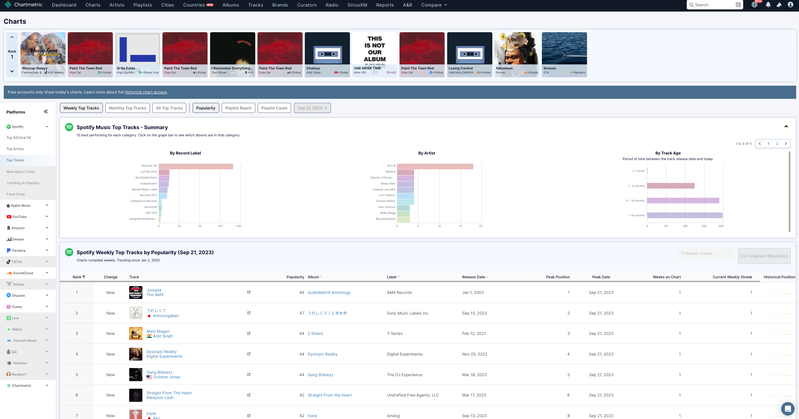
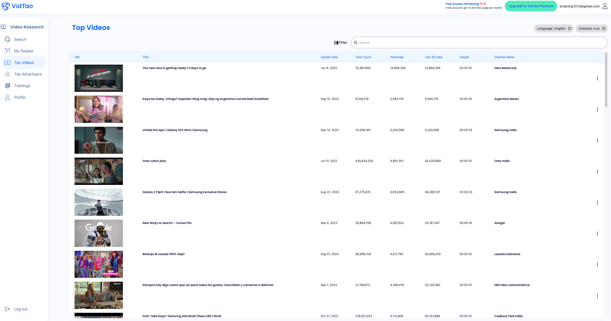
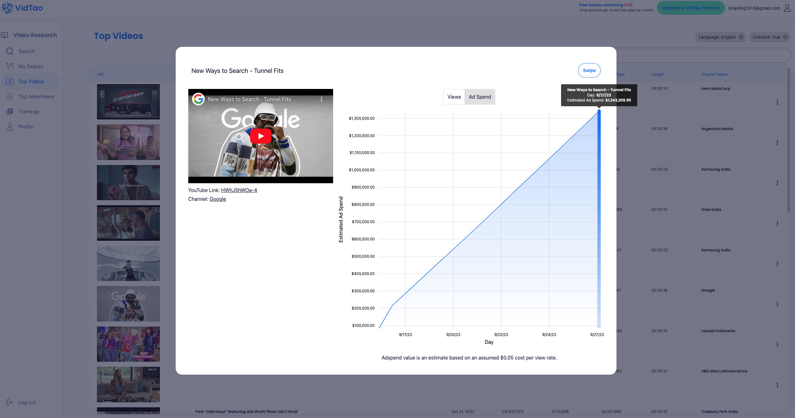

**Resources**

1. [A study of repetition and structure in popular music](https://www.cs.cmu.edu/~rbd/papers/repetition-ismir2022.pdf)
    1. Limitation: incapable of generating following the structure of music
2. [Essentia](https://essentia.upf.edu/): library that measures music characteristics such as tempo, mood etc, give other features along with measure of surprise
3. Pudding: data driven journalism website [Are Pop Lyrics Getting More Repetitive?](https://pudding.cool/2017/05/song-repetition/)

**Research Question: How virality influence music ~~culture~~ business?**

After watching the video on Tiktok to Spotify pipeline, I propose a research question: “**How virality influence music ~~culture~~ business?”**

Based on Continue, Pivot, or Put it Down flowchart, I choose this research question because it can be answered with data. The data exists, and we can gather a list of song from two these sources: Chartmetric, Spotify Viral 50

1. [Chartmetric](https://app.chartmetric.com/artists): this is like a music industry data dashboard. It is used to monitor social media streaming data. It has information from Spotify, YouTube, TikTok, and Instagram

2. [Spotify Viral 50](https://open.spotify.com/playlist/37i9dQZEVXbLiRSasKsNU9): this is a playlist for the top 50 viral songs globally. We can potentially also get songs from this playlist, and use our measure of perplexity to see how virality influences music business.

In regards to finding Youtube ads that have music, I came across a tool called [VidTao](https://dashboard.vidtao.com/m/videos/overview).

[VidTao](https://dashboard.vidtao.com/m/videos/overview) is like Youtube ads dataset that has music. Features Top Videos and Top Advertisers. The downside is that free accounts only get 15 minutes free usage per month. 

For example, we can see this [Youtube ads by Google](https://www.youtube.com/watch?v=HWhJ5hWOa-4&ab_channel=Google), which came out 3 weeks ago, has about a million dollars of ad spent. The music “all eyes on me” is very catchy.

Similarly, this [Youtube ads by Samsung India](https://www.youtube.com/watch?v=54wdwWRMouI&ab_channel=SamsungIndia) has music “don’t cha wish” that keeps repeats throughout the ads, making it very memorable.

If we come across Youtube ads that have music, a good way to find and save YouTube Ad is [adleg](https://www.adleg.com/debug). This tool generates Youtube ad links. 

Some good success metrics we can use to answer the research question

**Success metrics**

1. Listening Time: The total amount of time users spend listening to songs in the playlist. This metric can indicate how engaging and enjoyable the playlist is to your audience.
2. Play Count: The number of times the playlist is played. A high play count can be a sign of popularity and user engagement.
3. Followers and Subscribers: The number of people who follow or subscribe to the playlist. This metric shows the playlist's appeal and ability to retain an audience.
4. Retention Rate: The percentage of listeners who continue to listen to the playlist beyond a certain point. A high retention rate suggests that the playlist is keeping listeners engaged.
5. Likes and Favorites: The number of likes, favorites, or similar interactions the playlist receives. This metric can help gauge user satisfaction with the playlist's content.
6. Shares and Reposts: The number of times the playlist is shared or reposted by listeners. Sharing indicates that users find the playlist valuable enough to recommend to others.
7. Comments and Feedback: The quantity and quality of comments and feedback received on the playlist. Positive comments and constructive feedback can be indicators of playlist success.
8. Conversion Rate: If your playlist is promoting a specific artist, album, or product, you can measure the percentage of listeners who take the desired action, such as purchasing music or merchandise.
9. User Demographics: Understanding the demographics of your playlist's audience, including age, gender, location, and more, can help tailor future playlists to better suit your target audience.
10. Streaming Service Metrics: If your playlist is hosted on a streaming platform (e.g., Spotify, Apple Music), you can also track platform-specific metrics like streams, unique listeners, and playlist placement within the platform.
11. Playlist Growth Rate: The rate at which your playlist is gaining new followers or subscribers over time. This can help gauge the long-term popularity and reach of the playlist.
12. Playlist Collaborations: If you're collaborating with other curators or artists, you can measure the success of these partnerships by tracking metrics related to cross-promotion and audience overlap.
13. Engagement with Playlist Cover Art: If you've designed custom cover art for your playlist, you can track metrics related to user interactions with the cover, such as clicks or views.
14. Playlist Duration: The average time users spend listening to the playlist in a single session. This can help you determine if the playlist is the right length to hold listeners' attention.