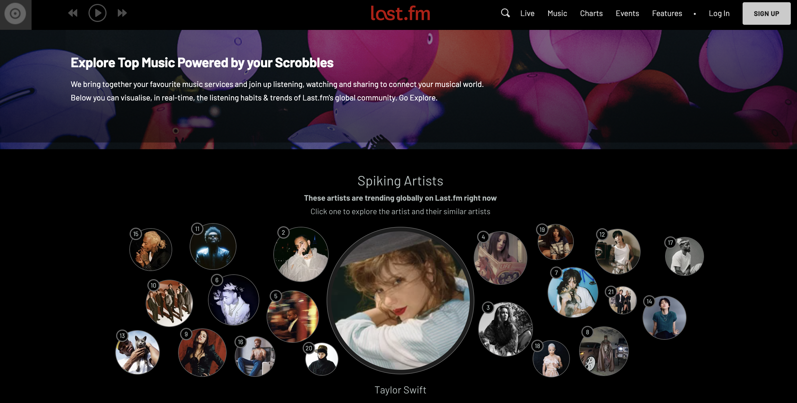
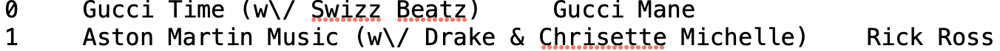

**Resources**

[Essentia](https://essentia.upf.edu/): library that measures music characteristics such as tempo, mood etc, give other features along with measure of surprise

[Audio-Based Music Structure Analysis](https://transactions.ismir.net/articles/10.5334/tismir.54): article that reviews recent advancements in audio-based music structure analysis, emphasizing the need for application-dependent systems and user-controlled output adaptation to address the subjectivity and complexity of musical structure.

[Python Msaf](https://pythonhosted.org/msaf/): a Python framework to analyze music structure

[Oriol Nioto](https://research.adobe.com/person/oriol-nieto/): developer of Python msaf

[Unsupervised Barwise Music Compression for Pattern Uncovering and Structural Segmentation](https://www.youtube.com/watch?v=DMPe79KLasg&ab_channel=C4DM-CentreforDigitalMusic)

**Research Question: How far away is the collaboration from each artist in the audio space?**

After exploring the Essentia library, I believe a good research question to pursue is “How far away is the collaboration from each artist in the audio space?” The reason is that we can measure features such as tempo, key, etc, which will be used to create song embedding. 

I gathered a comprehensive dataset of songs, which includes collaborative songs (where multiple artists collaborate) and non-collaborative songs (solo works of those artists). By query Last.fm API [http://www.last.fm/api](http://www.last.fm/api), we can retrieve tag information for songs, artists and albums. 

We have around 9000 songs in the playlist dataset including collaborative songs and non-collaborative songs. The playlist dataset is uploaded to the Github **playlist** folder. The folder contain the following files

<table>
  <tr>
   <td>tags.txt
   </td>
   <td>Social tags, using integer ID to represent songs
   </td>
  </tr>
  <tr>
   <td>song_hash.txt
   </td>
   <td>Mapping from integer ID to song's title and artist
   </td>
  </tr>
  <tr>
   <td>tag_hash.txt
   </td>
   <td>Mapping from integer ID to tag's name
   </td>
  </tr>
</table>

 \
In song_hash.txt, each line corresponds to one song, and has the format Integer_ID \t Title \t Artist \n. Songs with artists listed in the title within parentheses, like "Gucci Time (w/ Swizz Beatz)" or "Aston Martin Music (w/ Drake & Chrisette Michelle)," are collaborative songs. 

Whereas songs with only one artist listed, such as "Champagne Life" by Ne-Yo or “Find Your Love” by Drake, are non-collaborative or solo songs.

Now we have the dataset, we can use euclidean distance and cosine distance to measure the similarity or dissimilarity between collaborative songs and the average of each artist's non-collaborative songs. Euclidean distance will give us a measure of the physical distance between two points in the feature space. Cosine distance is useful for comparing the direction or angle between two vectors

**Success Metrics**

* Billboard Chart Performance: How well did the song perform on music charts (e.g., Billboard Hot 100)?
* Spotify Streams and Downloads: The number of streams and downloads on popular streaming platforms.
* Awards and Nominations: Awards such as Grammys, AMAs, and others.
* Critical Acclaim: Review scores from music critics or publications.
* Social Media Engagement: Metrics related to an artist's following and engagement on platforms like Instagram, Twitter, and YouTube.
* Concert Attendance and Ticket Sales: The number of concert attendees and ticket sales.
* Radio Airplay: The frequency of the song's play on radio stations.
* YouTube Views: The number of views on the official music video